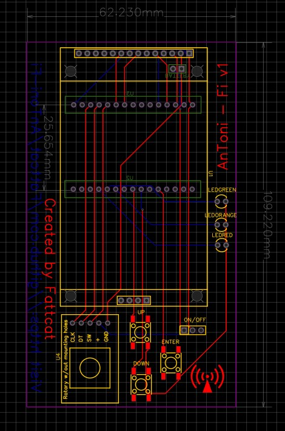
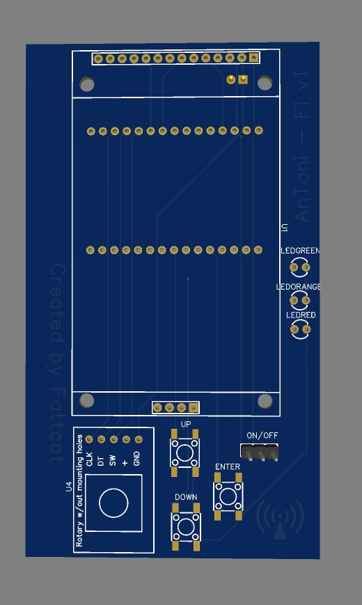

# AnToni-Fi
AnToni-Fi v1 is Based on ESP32 WiFi Board with all you need ... 

- Image of connection ESP32

- Image of board

# Connection

TFT 2.4 Inch Display - ESP32
TFT Pins - ESP32 Pins
- VCC --> 3.3V
- GND --> GND
- CS --> D15
- RESET --> D4
- DC --> D2
- MOSI (SDI) --> D23
- SCK --> D18
- LED --> 3.3V
- MISO (SDO) --> D19

# Buttons
- Button UP - 
- Button DOWN - 
- Button ENTER - 

# Diodes
- LED RED - 
- LED GREEN - 
- LED ORANGE - 

# Encoder
- CLK - 
- DT - 
- SW - 
